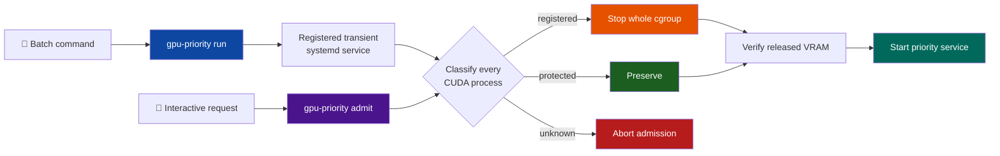
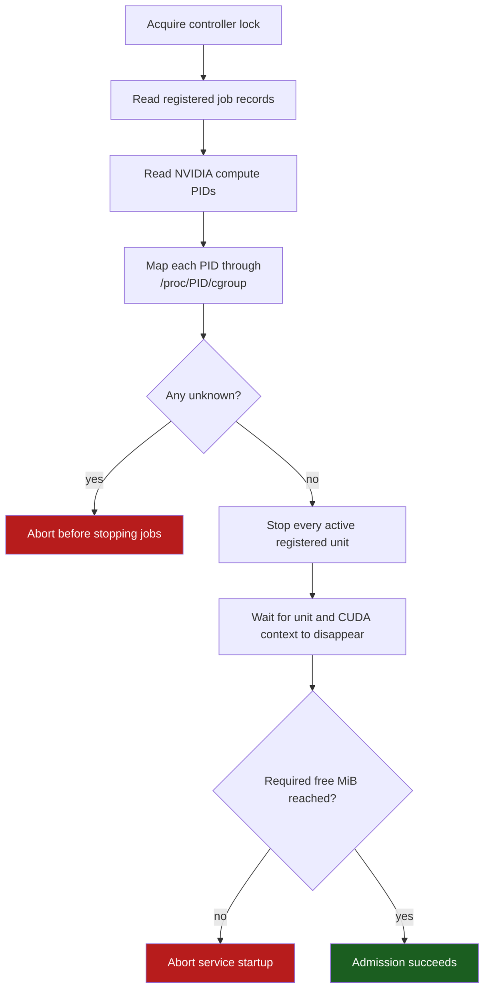
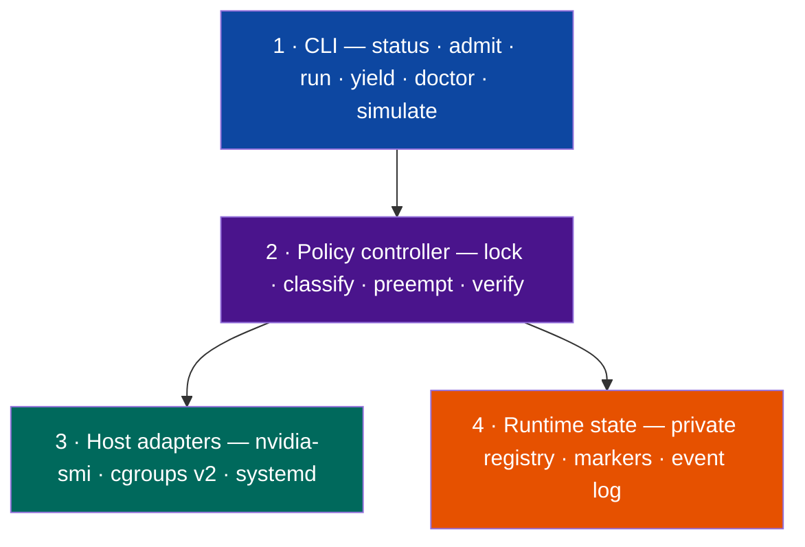

<div align="center">

# ⚡ gpu-priorityd

### A fail-safe **GPU right-of-way controller** for one interactive service and the batch jobs that borrow its NVIDIA GPU.

*Keep the accelerator productive between requests. When the priority service needs it back, stop only the work that explicitly agreed to be preempted — and abort on anything unknown.*


</div>

---

A local inference service should be ready when a person needs it, but leaving
its model resident can reserve most of a workstation GPU for hours. Stopping
the service frees the VRAM, yet using that space for training creates another
problem: how does the interactive service reclaim the GPU without blindly
killing unrelated CUDA processes?

`gpu-priorityd` turns that conflict into an explicit contract. Batch work
enters through a wrapper and runs inside a registered transient systemd unit.
When the priority service is admitted, the controller preserves protected
services, stops registered jobs, and refuses to proceed if it sees any CUDA
process it cannot identify. No process name guessing; no kill-all fallback.



## Table of contents

- [What it does](#what-it-does)
- [The admission policy](#-the-admission-policy) ← *the heart of it*
- [Architecture](#architecture)
- [Tech stack](#tech-stack)
- [Quickstart](#quickstart)
- [Linux integration](#linux-integration)
- [Security model](#security-model)
- [Under the hood](#under-the-hood)
- [Repository layout](#repository-layout)
- [Scope and limitations](#scope-and-limitations)
- [License](#license)

## What it does

| | Capability | How |
|---|---|---|
| ⚡ | **Reclaim the GPU for an interactive service** | Admission runs before service startup and waits for registered batch units to release their CUDA contexts |
| 🧪 | **Make batch work explicitly preemptible** | `gpu-priority run` registers the job first, then starts it as a transient systemd service |
| 🛡️ | **Protect critical CUDA services** | The priority unit and a configured unit allowlist are never stopped |
| ⛔ | **Fail closed on ambiguity** | Any CUDA PID outside the protected and registered sets aborts admission before preemption begins |
| 📦 | **Stop a complete workload** | `KillMode=control-group` terminates the transient unit and its descendants, not one guessed PID |
| ↩️ | **Report preemption distinctly** | The wrapper exits `75` when the priority service displaced a job |
| 🧹 | **Release residual model tensors** | Guarded `yield` stops the service process only after an application-owned safety predicate approves |
| 💻 | **Develop without NVIDIA hardware** | A deterministic simulator exercises the policy on macOS, Linux, or CI |

---

## ⚖️ The admission policy

This is the load-bearing part of the project. `gpu-priorityd` does not decide
that a process is expendable because it looks like Python, uses a lot of VRAM,
or belongs to a familiar PID. Preemptibility comes from prior registration.

| Class | Evidence | Admission action |
|---|---|---|
| **Protected** | Its cgroup resolves to the priority unit or an explicit protected unit | Preserve it |
| **Registered** | Its systemd unit has a controller-created runtime record | Stop the whole unit |
| **Unknown** | Anything else, including missing cgroup ownership | Abort without killing it |



The registry is written **before** `systemd-run` can reach CUDA. Admission also
stops active registered units that are not visible in `nvidia-smi` yet. That
closes the registration-to-allocation race: a request cannot slip between
"job started" and "GPU process appeared".

> **Why this shape?** The safe question is not *"which GPU process looks like a
> training job?"* It is *"which workload explicitly entered a contract that
> allows this controller to stop it?"* Everything else remains untouched.

## Architecture

Four small layers; application authentication and session state stay outside
all of them.



Two decisions carry most of the safety:

- **Registration is authorization.** A private record names the exact
  transient systemd unit that may be stopped. Commands are never retained in
  the registry or event log.
- **The application owns idleness.** `yield` can run a configured
  `safe_to_stop_command`; the controller does not confuse quiet GPU usage or a
  closed socket with permission to destroy live application state.

Full design notes: [`docs/DESIGN.md`](docs/DESIGN.md).

## Tech stack

| Layer | Tools |
|---|---|
| **Policy and CLI** | Python 3.11+ standard library · TOML configuration · `fcntl` lock |
| **GPU inspection** | NVIDIA `nvidia-smi` compute-process and memory queries |
| **Ownership** | Linux cgroups v2 via `/proc/<pid>/cgroup` |
| **Supervision** | `systemd-run` transient services · `systemctl` · `KillMode=control-group` |
| **Activation** | Optional systemd socket activation; server receives the inherited fd |
| **Testing** | `unittest` · fake supervisor and GPU inspector · hardware-independent policy simulation |

There are no third-party Python runtime dependencies. Production behavior does
depend on the Linux host tools listed above.

## Quickstart

Run the complete policy simulation without root, systemd, or a physical GPU:

```bash
git clone https://github.com/Mar-IA-no/gpu-priorityd && cd gpu-priorityd

python3 -m venv .venv
. .venv/bin/activate
python -m pip install -e .

gpu-priority simulate
python -m unittest discover -s tests -v
```

Then inspect the current host:

```bash
gpu-priority doctor
```

On macOS, `doctor` reports that the production backend is unavailable. That is
expected: the simulator and tests are the portable surface; real preemption
requires Linux, systemd, cgroups v2, and NVIDIA.

<details>
<summary><b>What the simulator proves</b></summary>

It creates an in-memory host with a protected CUDA service and a registered
batch unit that is active but has not reached CUDA yet. Admission must stop the
registered unit, preserve the protected one, and reach the memory threshold.
It then introduces an unknown CUDA process and verifies that a second admission
is blocked without killing it.

</details>

## Linux integration

Start from the sanitized example:

```bash
sudo install -m 0644 examples/gpu-priorityd.toml /etc/gpu-priorityd.toml
sudoedit /etc/gpu-priorityd.toml

sudo gpu-priority --config /etc/gpu-priorityd.toml status
```

Launch every expendable GPU workload through the wrapper:

```bash
sudo gpu-priority --config /etc/gpu-priorityd.toml run \
  --name nightly-train -- /absolute/path/to/python train.py
```

The transient service drops back to the invoking user and keeps that user's
current working directory; using `sudo` does not make the training command run
as root.

For automatic right-of-way, wire `gpu-priority admit` into the priority
service's `ExecStartPre`. The templates in [`deploy/`](deploy/) demonstrate
socket activation with a server that accepts systemd's inherited file
descriptor. Passive web endpoints may need separate routing so a health check
does not wake the GPU service.

Read [`docs/INTEGRATION.md`](docs/INTEGRATION.md) and complete its disposable
workload acceptance sequence before connecting a real service.

### Commands

```text
gpu-priority status
gpu-priority admit
gpu-priority run --name NAME -- COMMAND [ARGS...]
gpu-priority yield [--force]
gpu-priority doctor
gpu-priority simulate
```

## Security model

The controller runs with enough privilege to stop system services. Its threat
model is therefore about refusing ambiguous authority and keeping the control
surfaces local.

| Risk | Defense |
|---|---|
| An unrelated CUDA process gets killed | Unknown cgroup ownership aborts admission; there is no kill-all fallback |
| A protected service gets mistaken for batch work | Protected classification wins before registry classification |
| A job reaches CUDA before registration | Registry write and transient-unit start are serialized under one lock |
| A crafted record authorizes another unit | Record identity must match its private filename exactly |
| A user runs the wrapper with `sudo` | The transient service explicitly drops to the invoking user |
| Commands or credentials leak through status | Commands are not stored; public status contains only unit, name, owner, and creation time |
| Another local user blocks arbitration | The controller lock is owner-only (`0600`) |
| Service state is destroyed on yield | An application-specific predicate must return success, unless an operator explicitly uses `--force` |

The TOML file, executable, runtime registry, and systemd units are privileged
administration surfaces. Operational events can still contain usernames, unit
names, process names, and PIDs; do not expose the raw event log publicly.

See [`SECURITY.md`](SECURITY.md) for reporting and trust assumptions.

## Under the hood

<div align="center">

| | |
|---|---|
| **Python** | 11 source modules, standard library only at runtime |
| **Verification** | 21 unit and policy tests |
| **Portable acceptance** | one deterministic simulator, no GPU required |
| **Production target** | one Linux host · one NVIDIA GPU · one priority service |
| **Tracked footprint** | 29 files, under 100 KB at `v0.1.0` |
| **Preemption signal** | exit code `75` |

</div>

The release is an alpha MVP. The simulator, packaging, and read-only NVIDIA
inspection path have been exercised; deployments still need the application-
specific socket, idle predicate, memory threshold, and disposable-workload
acceptance test described above.

## Repository layout

<details>
<summary><b>Expand the tree</b></summary>

```text
gpu-priorityd/
├── src/gpu_priorityd/   controller · adapters · registry · CLI · simulator
├── tests/               policy, config, registry, Linux adapter and CLI tests
├── examples/            sanitized TOML configuration
├── deploy/              illustrative systemd service and socket templates
├── docs/                design and production integration guide
├── AGENTS.md             contributor safety invariants
├── SECURITY.md           trust model and vulnerability reporting
└── pyproject.toml · CHANGELOG.md · LICENSE
```

</details>

## Scope and limitations

- One host and one GPU index per controller instance.
- Batch jobs must use the wrapper. Manually launched CUDA is unknown and blocks
  admission by design.
- Preemption terminates a process; it does not migrate or restore checkpoints.
- The grace period is not a guarantee that a multi-gigabyte checkpoint will
  finish. Save periodically.
- The MVP does not implement application authentication, HTTP proxying, idle
  detection, automatic job restart, Kubernetes, Slurm, MIG, MPS, multi-GPU
  placement, or remote queueing.

## License

Released under the [MIT](LICENSE) license.

---

<div align="center">
<sub>Built around one rule: when ownership is ambiguous, stop nothing.</sub>
</div>
